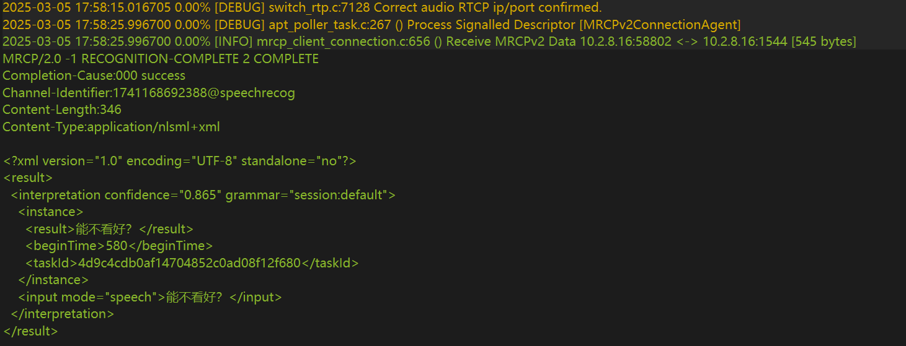
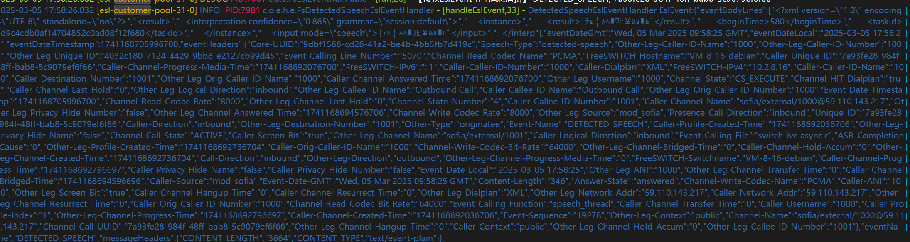

# openCallHub

#### [github地址](https://github.com/sxwdmjy/openCallHub)

#### 在线收集需求中。。。。。。。当前mrcp模块已经集成sip和mrcpV2协议，意在方便对接各大厂商的语音服务，待完善，有能力者可提交PR共同完善

---

## 一、项目概述
**openCallHub** 是一个开源的呼叫中心解决方案，提供全面的客服与语音交互功能，基于 Java 17 和 Spring Boot 开发，集成 FreeSWITCH、Kamailio 等通信组件。

### 核心价值
- **功能覆盖**：支持 SIP 呼叫、IVR 流程、MRCP 语音识别、外呼任务及报表分析。
- **技术栈**：Java 17 + Spring Boot 3.3.1 + MySQL + Redis + FreeSWITCH + Kamailio + Netty 等技术。
- **开源目标**：降低企业部署呼叫中心的门槛，鼓励社区共同完善。

---

## 二、项目结构

| 模块名称       | 职责说明                                  | 开发状态 |
|----------------|---------------------------------------|------|
| **och-api**    | 后端接口服务，提供 RESTful API 和 WebSocket 接口。 | 开发中  |
| **och-mrcp**   | 支持 MRCP V2 协议，对接语音识别/合成服务。            | 已完成  |
| **och-ivr**    | 交互式语音应答系统，定义电话自动流程（如语音导航、按键选择）。       | 开发中  |
| **och-esl**    | FreeSWITCH 的 ESL 客户端，用于控制通话和事件监听。     | 关键模块 |
| **och-system** | 系统管理模块（用户权限、技能组、路由策略等）。               | 开发中  |
| **och-common** | 基础功能模块，提供通用功能。                        | 已完成  |
| **och-file** | 支持文件上传下载。                             | 已完成  |
| **och-security** | 安全模块，提供用户认证和权限控制。     | 已完成  |

---

## 三、技术栈与关键组件

### 后端技术栈
- **框架**：Spring Boot 3.3.1、MyBatis-Plus、Spring Security、JWT。
- **数据库**：MySQL（主库）、Redis（缓存与会话）。
- **消息队列**：RabbitMQ（异步任务处理）。
- **通信协议**：SIP（FreeSWITCH）、MRCP V2（语音交互）。

### 核心组件
- **FreeSWITCH**：VoIP 核心引擎，处理媒体流与信令。
- **Kamailio**：SIP 代理服务器，实现负载均衡与安全防护。
- **ESL 客户端**：通过 Java Netty 实现与 FreeSWITCH 的交互。

---

## 四、快速开始指南

### 1. 环境准备
```bash
# 克隆项目
git clone https://github.com/iFindCallCenter/openCallHub.git
cd openCallHub

# 初始化数据库
mysql -u root -p < doc/system.sql

# 配置 application.yml（数据库、Redis、ESL 连接）
```
### 2. 启动服务
```
# 编译并运行
mvn clean install
java -jar och-api-0.0.1.jar
```
### 3. 基础测试
#### [演示地址](http://59.110.143.217/) `账号admin/12345678`
* 软话机登录1000账号和1001账号，然后1000号发起呼叫，接听1001号，挂断。 如需体验联系作者

## 五、开发计划与贡献方向
#### 1、开发计划
| 模块名称       | 开发状态 |
|------------|----------|
| **后台管理**   | 开发中  |
| **外呼拨打**   | 已完成  |
| **技能组**    | 已完成  |
| **ivr流程**  | 开发中  |
| **mrcp实现** | 已完成  |
| **外呼任务**   | 未开发  |
| **电话条集成**  | 未开发  |
| **报表**     | 未开发  |
#### 2、 贡献方向
- **mrcp模块增强** ：MRCP模块增强，提供语音识别和合成功能，支持多语言和定制需求。
- **ivr流程**：ivr流程设计，实现语音导航和按键选择。
- **报表**：报表功能，提供通话记录、IVR流程、外呼任务等报表分析。
- **电话条集成**：电话条集成，提供电话条功能，用于快速呼叫。
- **外呼任务**：外呼任务功能，提供外呼任务管理，支持定时外呼、手动外呼等。
- **前端**：前端界面优化，提高用户体验。
- **优化**：优化项目代码，提高性能和体验。
- **文档**：完善文档，提高项目可读性。
- **测试**：完善测试用例，提高项目质量。
- **其他**：根据项目需求，提供其他功能。
#### 3、 mrcp识别效果



## 六、常见问题与注意事项
#### 1、 如何部署到服务器上？
1. 部署到服务器上，需要配置好服务器环境，包括 JDK、MySQL、Redis等。
2. FreeSWITCH 需要部署到服务器上，并配置好 SIP 监听地址和端口(参考freeswich.md)
3. Kamailio 需要部署到服务器上，并配置好 SIP 监听地址和端口(参考kamailio.md)
4. mrcp模块需要部署到服务器上，并配置好 MRCP 监听地址和端口

## 七、贡献指南与权益保障
#### 1、贡献流程
1. **Fork仓库**：Fork到自己的 Gitee或者GitHub 账户下。
2. **创建分支**：git checkout -b feature/your-feature-name
3. **提交代码**
```
git commit -m "feat: 修改bug 或者 新增功能"
git push origin feature/your-feature-name
```
4. **创建 Pull Request**：在 Gitee 或者 GitHub 上创建 Pull Request，并等待审核。

## 八、项目维护与支持
#### 1. 线路需求: 有线路需求可以联系作者
#### 2. GitHub Issues：提交功能需求或 Bug 反馈。
#### 3. 星球咨询: 有业务需求定制化开发可以联系作者，或者加星球咨询


## 捐献作者
作者为兼职做开源,平时还需要工作,如果帮到了您可以请作者吃个盒饭

## 九、法律与免责声明
- **说明：** 本项目仅供学习交流使用，禁止用于非法用途。如需商业部署，请联系作者获取授权。贡献者需遵守开源协议，确保代码合规性。

## 十、附录

- [前端地址](https://gitee.com/zhongjiawei999/waihu-app)
- [FreeSWITCH 文档](https://developer.signalwire.com/freeswitch/FreeSWITCH-Explained)